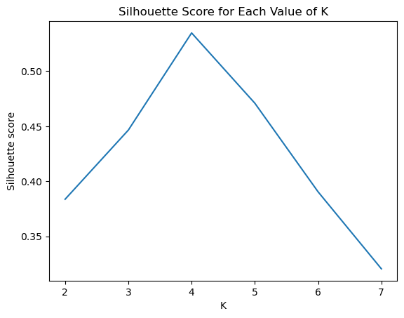
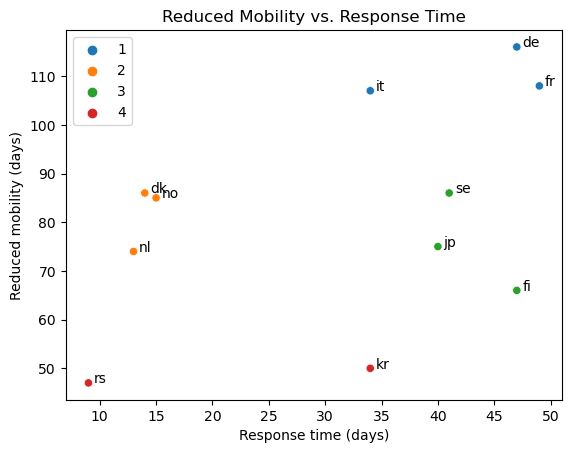

# How Has Political Sentiment Changed Over the Course of the Pandemic?

## Grouping Countries by Response

We can imagine that countries can be grouped together based on their response to the COVID pandemic.
From `interventions.csv`, we can calculate how long it took for the first measures to be imposed after the first case in the country, and for how long mobility in the country was reduced. Based on these two measures, we can try to find clusters of countries in order to group them.

We calculate the Silhouette Score for different numbers of clusters in order to find the optimal number of clusters.

We can identify the following groups of countries:

1. Big European economies which took a long time to react to COVID (possibly due to not wanting to harm the economy or being less able to enforce measures over a large population) and ended up having long periods of reduced mobility (France, Germany, Italy).

2. Smaller highly developed European countries which reacted quickly to COVID and had shorter periods of reduced mobility (Denmark, Netherlands, Norway).

3. Countries which took longer to react to COVID but had shorter periods of reduced mobility (Finland, Japan, Sweden).

4. Countries with relatively short periods of reduced mobility compared to other countries (Serbia, South Korea).

Spain is the only country not featured in the plot above. We take a look at its entry in `interventions.csv`.

