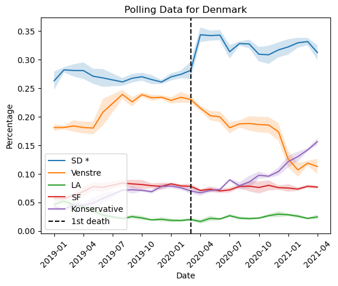

We observe that for countries in group 1 (large economies), the populations reacted differently. In Germany, a sharp rise in popularity for the ruling party was observed, indicating support for stability and implementating sanitary measures. In Spain, it is the main opposition party which sees a rise in popularity. In Italy, we observe a continual decrease in support for the main party in government which began before the pandemic itself, indicating domestic issues were more influencial than the pandemic for the party's popularity.

### Group 2

In contrast, countries in group 2 (smaller countries where the government reacted quickly) all observed sudden sharp increases in support for the government. In the case of Norway, the ruling party's steady decrease in popularity was almost entirely negated. This suggests that the populations greatly valued stability and the quick response of their governments.

### Group 3

In group 3, we observe a similar effect whereby support in the government increases.

It is clear that among the large economies, support in the government did not increase at the start of the pandemic. However, this could be the case for small European countries. To gather evidence to support this hypothesis, we perform t-tests to see if there are statistically significant differences in the polling of ruling parties immediately before and after the beginning of the pandemic in the smaller countries. We take our significance level to be 0.05.

We see that, even after our correction to take into account the multiple hypothesis testing problem, each of our tests have shown there to be a statistically significant difference in the polling of the main ruling party in the period immediately before and after the start of the pandemic. We, therefore, can reject the null hypothesis that there is no such difference.

We can conclude that in countries with smaller populations, governments saw an increase in support. In these such countries, perhaps the well-being of the population plays a more significant role when it comes to support in the government. We do not observe this in countries with large populations, possibly due to the population believing that keeping the economy open is more important.