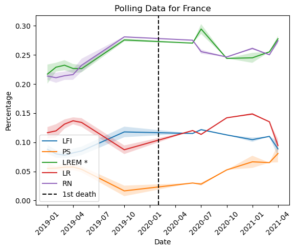

## Grouping Countries by Response

We can imagine that countries can be grouped together based on their response to the COVID pandemic.
From `interventions.csv`, we can calculate how long it took for the first measures to be imposed after the first case in the country, and for how long mobility in the country was reduced. Based on these two measures, we can try to find clusters of countries in order to group them.

We calculate the Silhouette Score for different numbers of clusters in order to find the optimal number of clusters.

We can identify the following groups of countries:

1. Big European economies which took a long time to react to COVID (possibly due to not wanting to harm the economy or being less able to enforce measures over a large population) and ended up having long periods of reduced mobility (France, Germany, Italy).

2. Smaller highly developed European countries which reacted quickly to COVID and had shorter periods of reduced mobility (Denmark, Netherlands, Norway).

3. Countries which took longer to react to COVID but had shorter periods of reduced mobility (Finland, Japan, Sweden).

4. Countries with relatively short periods of reduced mobility compared to other countries (Serbia, South Korea).

Spain is the only country not featured in the plot above. We take a look at its entry in `interventions.csv`.

The response time was not swift relative to other countries. The datapoint is not plotted due to having an undefined duration of the reduced mobility period, since there is no date for the return to normal mobility levels. We can say that the reduced mobility period is also a long one, which would place Spain in group 1 - big European economies with a long response time and long period of reduced mobility.

## Obtaining Polling Data

We obtain polling data from [European Opinion Polls as Open Data](https://filipvanlaenen.github.io/eopaod/) - a collection of opinion polls for European countries.

The dataset, understandably, lacks data for Japan and South Korea. Data for Serbia is not present either. Nonetheless, we still have data for 9 of the 12 countries, so we continue working with these countries instead.

Our final groups of countries based on response to the pandemic are:

1. France, Germany, Italy, Spain
2. Denmark, Netherlands, Norway
3. Finland, Sweden

We also have the following geographic groups:

1. Northern Europe - Denmark, Finland, Norway, Sweden
2. Western Europe - France, Germany, Netherlands
3. Southern Europe - Italy, Spain

For each country, we plot the polling data for the current 5 most represented parties in parliament (excluding parties founded in 2021 or later). Our error bars represent the standard deviation each month.

In addition, we denote with `*` the main party in government at the beginning of the pandemic and when the first COVID related death occured. This represents the beginning of when the population becomes seriously affected by the virus.

### Group 1

We observe that for countries in group 1 (large economies), the populations reacted differently. In Germany, a sharp rise in popularity for the ruling party was observed, indicating support for stability and implementating sanitary measures. In Spain, it is the main opposition party which sees a rise in popularity. In Italy, we observe a continual decrease in support for the main party in government which began before the pandemic itself, indicating domestic issues were more influencial than the pandemic for the party's popularity.

### Group 2

In contrast, countries in group 2 (smaller countries where the government reacted quickly) all observed sudden sharp increases in support for the government. In the case of Norway, the ruling party's steady decrease in popularity was almost entirely negated. This suggests that the populations greatly valued stability and the quick response of their governments.

### Group 3

In group 3, we observe a similar effect whereby support in the government increases.

It is clear that among the large economies, support in the government did not increase at the start of the pandemic. However, this could be the case for small European countries. To gather evidence to support this hypothesis, we perform t-tests to see if there are statistically significant differences in the polling of ruling parties immediately before and after the beginning of the pandemic in the smaller countries. We take our significance level to be 0.05.

We see that, even after our correction to take into account the multiple hypothesis testing problem, each of our tests have shown there to be a statistically significant difference in the polling of the main ruling party in the period immediately before and after the start of the pandemic. We, therefore, can reject the null hypothesis that there is no such difference.

We can conclude that in countries with smaller populations, governments saw an increase in support. In these such countries, perhaps the well-being of the population plays a more significant role when it comes to support in the government. We do not observe this in countries with large populations, possibly due to the population believing that keeping the economy open is more important.